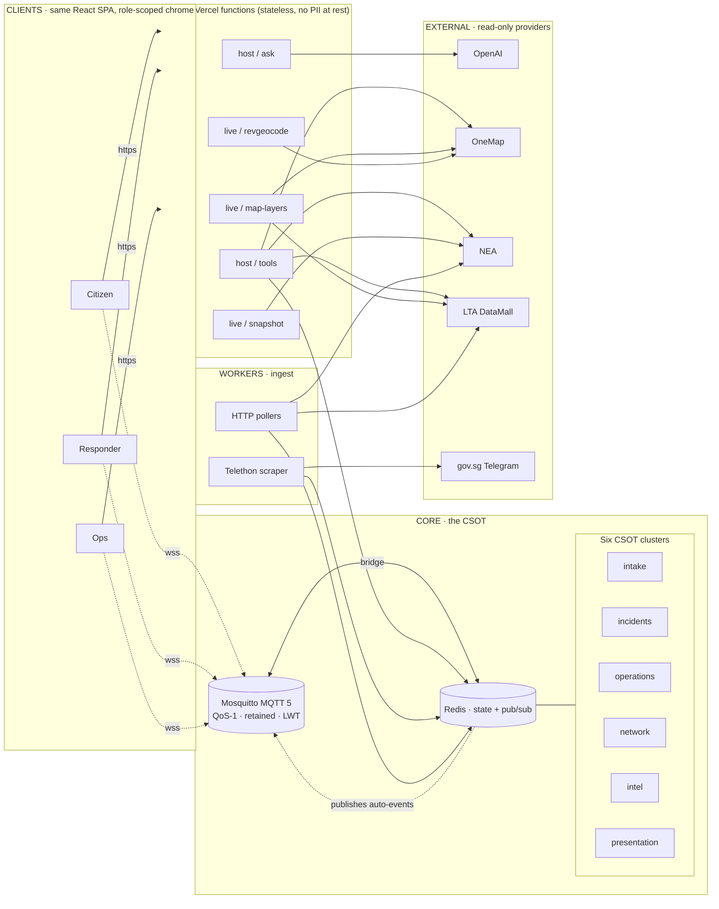
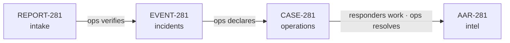

# Kampung Kaki — Architecture

**Status:** Live, deployed, end-to-end.
**Audience:** Engineers, judges, future maintainers.
**Scope:** Everything from the citizen's thumb to the broker on the cloud, plus the
single source of truth that ties it together.

---

## Reading guide

This document is layered so you can stop reading at the depth you need:

- **Section 1** is the one-paragraph picture.
- **Section 2** is the architecture diagram with prose explaining each layer and
  every arrow.
- **Sections 3–6** zoom into specific concerns (state model, transport, AI,
  resilience) for engineers who need to extend the system.
- **Section 7** is a translation guide for redrawing the diagram in React Flow
  on a canvas, with the node and edge vocabulary kept deliberately small.

---

## 1 · The picture in one paragraph

Kampung Kaki is a civic emergency-coordination platform with three role-scoped
clients — citizen, responder, ops — sharing **one canonical state tree** ("the
CSOT") that lives on an MQTT broker backed by Redis. Clients talk to that
broker over a persistent WebSocket for state, and to a small set of stateless
edge functions over HTTPS for AI and live-data fan-out. Background workers
ingest gov-data feeds and push them into the same CSOT so a heat advisory is
indistinguishable, downstream, from a citizen report. **The whole system is
designed so that no single component has to be online for the rest to keep
working** — the broker survives reconnects with retained messages, the edge
functions are stateless, and every external provider is allowed to fail loudly
rather than be papered over with an LLM guess.

---

## 2 · The system, layer by layer

The platform is organised into four runtime layers. Reading top-to-bottom
roughly follows a request: a citizen taps SOS, the broker accepts it, ops
verifies, workers continue to ingest external context, responders pick up
the case — and at every step, the CSOT is the only thing that has to be
right.

### 2.1 · Diagram

### 2.2 · Clients

The three clients are not three apps. They are **one React single-page
application** with the same bundle, the same build, and the same routes. The
active role is stored in `presentation.role` on the CSOT and gates which
chrome, dock actions, and workspaces render. A judge can switch from citizen
to ops with one click and watch the same incident take three different shapes
without a page reload or a second login.

Clients hold no business state of their own. Every list they render —
reports, SOS, cases, responders, source health, notifications — is the
result of subscribing to a CSOT topic and reflecting the retained message
plus any subsequent updates. If the WebSocket drops, the client buffers
local actions and replays them on reconnect; if the broker disappears
entirely, the last-known state survives in IndexedDB and the UI shows a
"degraded" banner instead of fabricating numbers.

### 2.3 · Edge layer

The edge layer is a deliberately small set of Vercel functions. They are
**stateless** by design — no PII at rest, no database connection pool, no
session storage. Their sole job is to translate an HTTPS request from a
client into one or more outbound calls to OpenAI or a gov-data provider,
and return a tidy JSON shape with provenance chips attached.

Five functions cover the whole surface:

| Function              | Purpose                                                    |
| --------------------- | ---------------------------------------------------------- |
| `host/ask`            | AI host. Routes by `(role, workspace)` to a system prompt. |
| `host/tools`          | Nine grounded tool calls the AI may invoke.                |
| `live/map-layers`     | OneMap themes (AED, hospital, fire post) + LTA overlays.   |
| `live/revgeocode`     | Reverse-geocode a `(lng, lat)` into a Singapore address.   |
| `live/snapshot`       | NEA PSI + rainfall snapshot, cached briefly at the edge.   |

The contract these functions hold with the rest of the system is the
**never-invent guardrail**: if a provider is rate-limited, down, or
not-configured, the response says so explicitly. The AI host is allowed to
refuse to answer; it is not allowed to hallucinate.

### 2.4 · Core — the CSOT

The Canonical State Of Truth is the centre of gravity of the architecture.
Everything else exists to write into it or read from it.

It is implemented as two cooperating pieces:

- **Mosquitto MQTT 5** is the transport. Every state-bearing topic is
  published with QoS-1 and the retained flag set, so a client that joins
  the broker sixty seconds late immediately receives the current state of
  every object it subscribes to, without polling, without an API call.
  Last Will and Testament is used for presence — when a responder drops
  off the network, their LWT message marks them offline within the
  keepalive window.
- **Redis** is the durable copy. The broker is paired with a Redis bridge
  so retained messages survive a broker restart, and so the worker tier
  has a fast read-side it can hit without going through MQTT subscriptions.

The contents of the CSOT are organised into **six clusters**, which are the
top-level branches of the relation tree maintained in
`src/state/relations.ts`. They are listed in detail in Section 3.

### 2.5 · Workers

The worker tier is everything that has to run continuously without a user
present. Today it covers two responsibilities:

- **Telethon scraper** — reads gov.sg, SCDF, SPF, MOH, and PUB Telegram
  channels, normalises each post into either a structured advisory or a
  free-text intel item, and writes it into the `intel` cluster.
- **HTTP pollers** — pull NEA PSI, NEA rainfall, and LTA DataMall on a
  cadence appropriate to each feed (PSI hourly, rainfall five-minute,
  traffic incidents one-minute). Threshold breaches automatically emit
  events into the `incidents` cluster with the prefix `LIVE-PSI-` or
  `LIVE-RAIN-` so they are distinguishable from human-authored events but
  consumed identically downstream.

Workers never talk to clients directly. They write to Redis, and Redis
publishes onto MQTT. This is the single rule that makes the worker tier
horizontally scalable and the client tier oblivious to which workers
exist.

### 2.6 · External providers

OpenAI, OneMap, NEA, LTA DataMall, and gov.sg Telegram sit outside the
trust boundary. They are **read-only** from the platform's point of view:
nothing the system does writes back into a gov-data feed. Each response
carries a provenance tag (`tool: onemap`, `tool: nea_psi`, …) that
propagates through the AI host into the citizen-facing reply, so the
audience always knows whether a number came from a verified source or
from the language model itself.

---

## 3 · The CSOT, in detail

The CSOT is the only piece of this architecture you cannot route around.
Every role is a reader and a writer of some subset of it; every audit
trail is a derivation of it; every UI is a projection of it.

### 3.1 · Clusters

The six clusters are designed so that each one has a single owner role
and a single primary responsibility. A cluster is not a database table —
it is a *concept*. Multiple object types may live in the same cluster
when they share a lifecycle.

**Intake** holds citizen-originated signals — reports and distress
sessions — at low trust. An object lives in intake until an ops operator
verifies it, at which point a corresponding object is born in incidents
and the original intake object is annotated rather than deleted.

**Incidents** holds the canonical, ops-published version of an emergency
— the verified event plus any declared emergency zone polygon. This is
the only cluster from which broadcasts are made.

**Operations** holds live response work. A case room is the operational
twin of an incident — the same `*-281` suffix — and contains chat,
responder positions, and beats. The responder roster itself also lives
here, because a responder's state is fundamentally operational.

**Network** holds identity. App users, capability groups (like
"Bukit Batok CFR"), and volunteer events. This is the slowest-changing
cluster and the only one with strong write authentication.

**Intel** holds situational awareness — the health of every external
data source, the latest live snapshot from NEA, the append-only action
log, and role-scoped notifications. The action log is the audit trail.

**Presentation** holds shell state — the active role, the open drawer,
the tracking pill. It is the only cluster that does not persist; it
exists in the CSOT only to coordinate between tabs of the same user.

### 3.2 · Edges between clusters

The clusters are not isolated; they are wired together by a small set of
transitions, each one triggered by a specific actor:

- A citizen reports → `intake.reports` accepts the object.
- Ops verifies a report → an object is born in `incidents.events` with
  the same incident ID, and the intake object is marked verified.
- Ops declares an incident → a `operations.cases` room is created and
  responders within range are notified.
- A responder joins → their entry in `operations.responders` updates to
  reflect membership.
- An NEA threshold breaches → an event is auto-emitted into
  `incidents.events` without ever passing through intake.
- Every transition above also writes to `intel.actionLogs` with the
  actor, the action, the target, and a timestamp.

This is the audit trail that today's three-app stack cannot produce — not
because the data is unavailable, but because it is spread across four
databases owned by three different agencies.

### 3.3 · The canonical incident lifecycle

The four-step lifecycle below is the spine of the demo and the
justification for the cluster taxonomy.

A citizen files **REPORT-281** with category, GPS, evidence, and
self-rated severity. The report sits in intake until ops corroborates it
against other reports or against live intel; once corroboration crosses
the threshold, ops promotes it to **EVENT-281** in incidents. Ops then
either dispatches an existing response or declares **CASE-281** to
co-ordinate volunteers and field units. As the case progresses, every
beat — a responder accepting, a status update, a chat message — appends
to the case object. When the case resolves, ops closes it and the Host
AI offers to draft **AAR-281** from the case log; the AAR is committed
into `intel.actionLogs` and the case object retains a pointer to it.

This is one incident, four objects, one ID stem. **The audit trail is
not a separate system; it is a side effect.**

---

## 4 · Transport — why MQTT

The choice of MQTT over the more obvious HTTP-polling-or-WebSocket-API
pattern is the single biggest architectural decision in the project, and
it falls out of one observation: emergencies happen at the worst possible
time for an HTTP request.

When a haze advisory triggers, every Singaporean app simultaneously
refreshes its data feed. Cell broadcast saturates, HTTP endpoints
rate-limit, and any app that depends on synchronous request-response
spends the next ten minutes returning spinners. MQTT side-steps this for
three reasons:

- **Retained messages.** Every state-bearing topic carries its last
  retained value on the broker. A client that connects late receives the
  current state immediately, without a single API call. There is no
  thundering-herd problem because nobody is *requesting* — they are
  *subscribing*.
- **QoS-1 with store-and-forward.** When a citizen taps SOS while their
  4G connection is fluttering, the client buffers the publish locally
  and the broker accepts it on the next successful round-trip. Delivery
  is guaranteed at-least-once. Duplicate suppression happens at the
  application layer using idempotent IDs.
- **Last Will and Testament for presence.** A responder going offline is
  detected by the broker, not the application. The "online responders"
  list is therefore correct within the keepalive window even when the
  responder did not get a chance to send a clean disconnect.

The topic plan is regular: `csot/<cluster>/<type>/<id>` for individual
objects, `csot/<cluster>/<type>/index` for the live id list, and
`csot/presence/<role>/<userId>` for presence. Clients subscribe to the
slices their role needs and ignore the rest. Ops subscribes to almost
everything; citizens subscribe to events near them and their own SOS;
responders subscribe to events plus the cases they are members of.

---

## 5 · The Host AI

The Host AI is **not one prompt and one model**. It is a dispatcher that
selects a system prompt and a tool subset from a five-row matrix indexed
by `(role, workspace)`. The dispatcher lives in `api/host/ask.js`; the
prompts live in `api/host/systemPrompts.js`; the tool implementations
live in `api/host/tools.js`.

The matrix is small on purpose:

| Role        | Workspace            | What the AI is for                          |
| ----------- | -------------------- | ------------------------------------------- |
| Citizen     | citizen_alert        | Safety advisor — Situation / Do now / If worse |
| Citizen     | citizen_assistant    | General-purpose AI Kaki                     |
| Responder   | responder_case       | Case-room copilot, aware of slash commands  |
| Responder   | responder_mission    | Mission-board copilot for joinable cases    |
| Ops         | ops_command          | Dispatch and declaration copilot            |

Every prompt declares the subset of tools it is allowed to call.
Anything outside that subset returns `unavailable` rather than letting
the model guess. The tools available today are: `getLivePsi`,
`getLiveRainfall`, `getNearestAed`, `getNearestHospital`, `revgeocode`,
`getActiveSos`, `getCaseRoster`, `getResponderRoster`, and distance
helpers. Adding a new workspace is one row in this matrix and one new
prompt file. **No prompt template ever ships in the client bundle.**

The reason this matters for an emergency-coordination product is that a
hallucinated AED location costs minutes when minutes are the entire
budget. The product can survive an AI that says "I don't know";
it cannot survive an AI that confidently says the wrong thing.

---

## 6 · Resilience

The platform is designed to degrade gracefully along three independent
axes. None of the three depend on the others, which is why the system
keeps working when any single layer fails.

**Source health.** Every external provider has a `SourceHealth` entry in
the intel cluster that records its current state — `fresh`, `stale`,
`down`, `shell_only`, `not_configured`, `unavailable`. The UI reads this
directly: when NEA is `down`, the PSI tile renders as "unavailable"
rather than "0". The God Mode dock can cycle a source's state on demand
to demonstrate this in a live pitch.

**Client offline.** The client persists the last-known CSOT in
IndexedDB. When the WebSocket drops, the UI shows a "degraded" banner,
disables write actions that require coordination, and continues to
render the cached state. Reads continue to work; writes queue locally
and replay on reconnect.

**Broker offline.** The broker is the hardest piece to lose. When it
does happen — restart, network partition — clients reconnect with their
last retained-message timestamps and the broker replays anything they
missed. The retained-flag policy means cold-starting from zero is a
matter of seconds, not minutes.

The product never *claims* it is working when it is not. A red dot is
better than a wrong number.

---

## 7 · Drawing this in React Flow

The canvas version of the system diagram should keep the visual
vocabulary intentionally small so the diagram stays legible at any
zoom level. Four node types and four edge styles cover everything in
this document.

**Nodes:**

- **Band** — the five horizontal containers (`CLIENTS`, `EDGE`, `CORE`,
  `WORKERS`, `EXTERNAL`). Render as a faint-bordered group with a
  bold uppercase label in the top-left.
- **Service** — every concrete service: edge functions, broker, Redis,
  workers. Render as a brutalist panel with a 2px black border and a
  4px hard shadow.
- **Cluster** — the six CSOT clusters. Render the same way as services,
  but tinted red so they are visually identified as state, not compute.
- **External** — read-only providers. Render with a dashed border and
  a muted fill to mark them as outside the trust boundary.

**Edges:**

- **Solid red, dotted variant for WebSocket** — MQTT, the state plane.
- **Solid cyan** — HTTPS request-response, the RPC plane.
- **Dashed amber** — worker ingest into Redis.
- **Dashed grey** — external provider call.

Bands stack top to bottom. Services flow left to right inside their
band. The six CSOT clusters sit in a 3×2 grid inside the `CORE` band.
Keep positions deterministic so the canvas does not reflow when nodes
are added.

---

## 8 · What this replaces

A final framing — the platform is positioned against the existing
fragmented stack rather than against a clean-slate competitor.

| Today                                | Kampung Kaki                              |
| ------------------------------------ | ----------------------------------------- |
| SGSecure (citizen reports)           | `csot/intake/report/*`                    |
| Phone call into the SCDF Ops Centre  | `ops · verify` transition (logged)        |
| myResponder (CFR alert push)         | Responder subscription to incident topics |
| Internal radio log and paper AAR     | Case chat plus `intel.actionLogs`         |
| Four databases, four reconciliations | One CSOT, one audit trail                 |

The architecture is not a replacement for SCDF or SPF or the gov-data
feeds. It is a replacement for the **glue between them** — the manual,
error-prone, latency-rich hand-off that today happens by phone, SMS,
and paper. That glue is what fails first when the network buckles, and
it is the only thing in the chain that no agency owns end-to-end.

We do.
